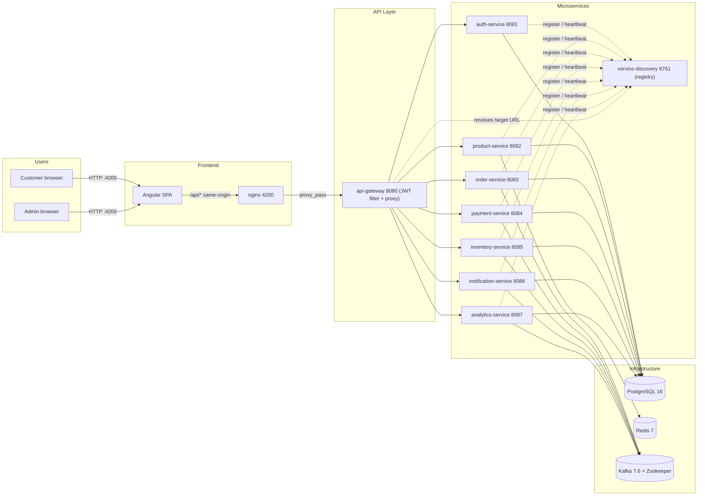
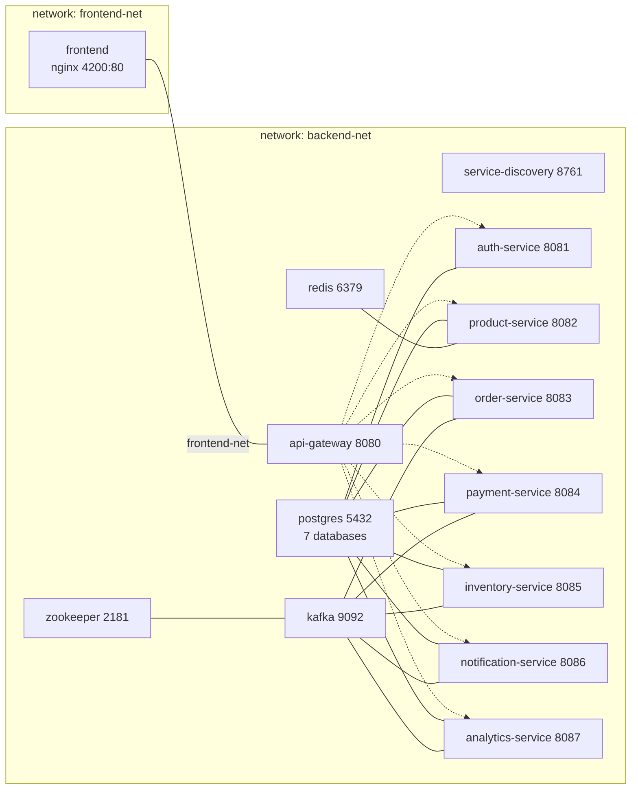
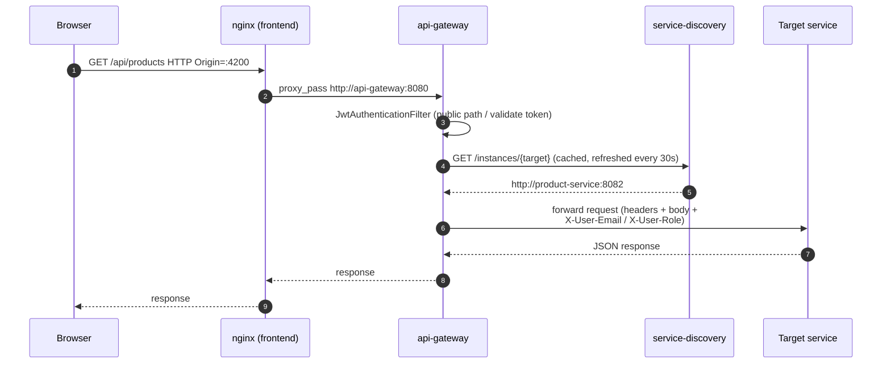
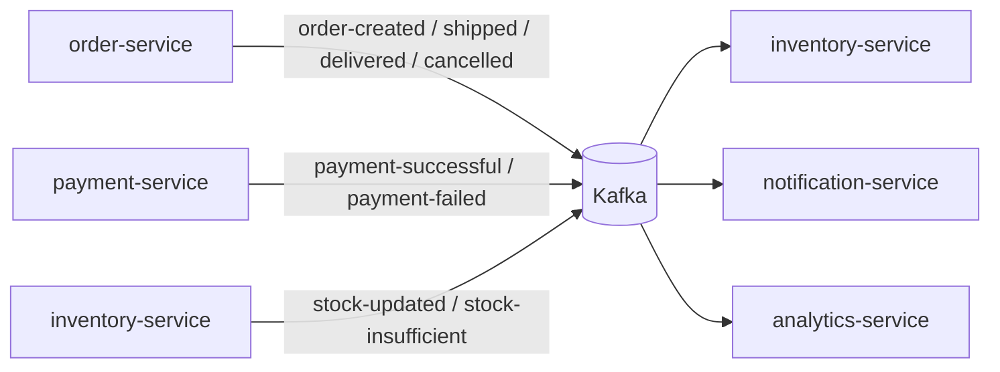

# 18.2 - Architecture Diagram

This document describes the physical and logical architecture of ShopSphere,
including the container topology, the request flow through the API gateway, the
event-driven data flows and the observability stack.

## System Context



## Container Architecture (Docker Compose)



## Request Flow Through the Gateway



- Every path under `/api/*` is proxied by `ProxyService` (WebFlux `RouterFunction`
  + `WebClient`), using the longest matching prefix of the route map.
- Public prefixes: `/api/auth/` and `/api/products/`.
- Protected prefixes (`/api/orders/`, `/api/payments/`, `/api/cart/`,
  `/api/inventory/`, `/api/notifications/`, `/api/analytics/`, `/api/user/`,
  `/api/admin/`) require a valid `Authorization: Bearer <JWT>`.
- On success the gateway injects `X-User-Email` and `X-User-Role`; downstream
  services use these headers for admin checks.
- OPTIONS preflight requests are answered directly with CORS headers.
- Safe (GET) requests are retried once (max-attempts 2, 1 s delay) on 5xx errors;
  failures produce 502, and unresolved routes produce 404.

## Event-Driven Integration (Kafka)

| Topic | Producer | Consumers |
|-------|----------|-----------|
| `order-created` | order-service | inventory, notification, analytics |
| `order-shipped` | order-service | notification |
| `order-delivered` | order-service | notification |
| `order-cancelled` | order-service | notification |
| `payment-successful` | payment-service | notification, analytics |
| `payment-failed` | payment-service | notification, analytics |
| `stock-updated` | inventory-service | (monitoring/observability) |
| `stock-insufficient` | inventory-service | (monitoring/observability) |



## Observability Stack

```mermaid
flowchart LR
    subgraph Apps["Application Containers"]
        SVC["9 Spring Boot services"]
        KF["kafka / zookeeper"]
    end

    SVC --->|/actuator/prometheus scraped| P[("Prometheus 9090")]
    SVC --->|structured JSON logs| LT[("Loki 3100")]
    KF --->|logs via docker driver| LT

    SLTS["Promtail (docker_sd + /var/log/shopsphere/*.log)"] --> LT
    P --> G["Grafana 3000"]
    LT --> G

    G --> DASH["ShopSphere dashboard<br/>(10 panels)"]

    SVC --->|metrics endpoint (Micrometer)| P
```

The monitoring stack is defined in `docker-compose.monitoring.yml` and uses
official Prometheus, Grafana, Loki and Promtail images. Prometheus scrapes every
service via `host.docker.internal:<port>`; Promtail discovers containers named
`shopsphere*`, `kafka*` or `zookeeper*` and ships JSON logs to Loki. Grafana is
provisioned with a Prometheus datasource, a Loki datasource and the
`shopsphere-overview` dashboard.