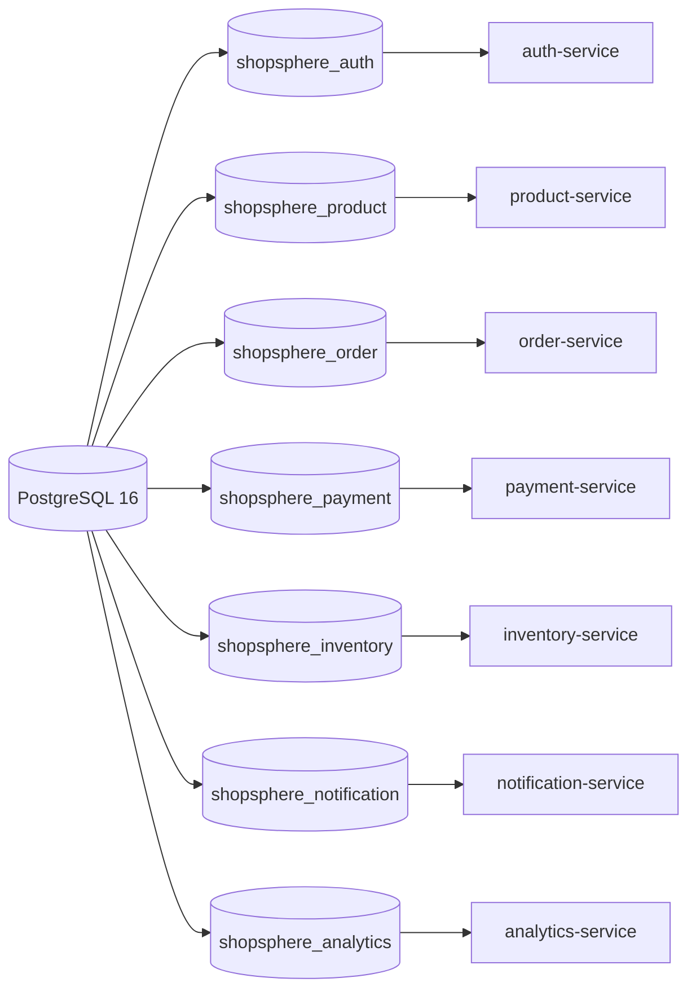
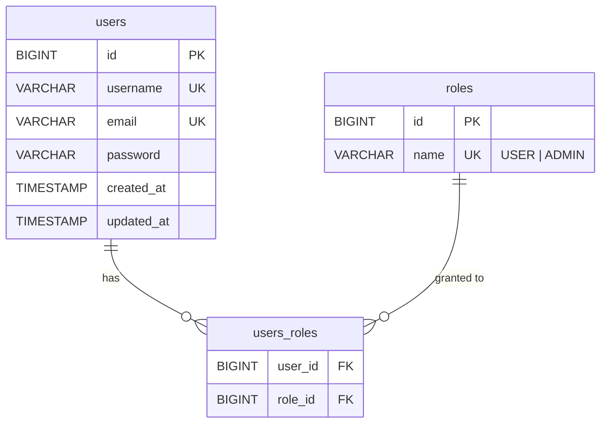
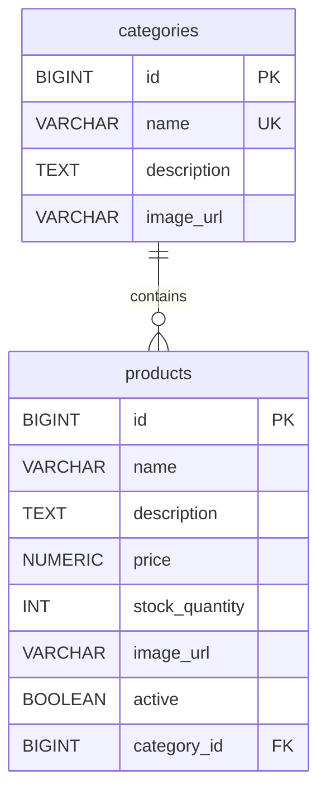
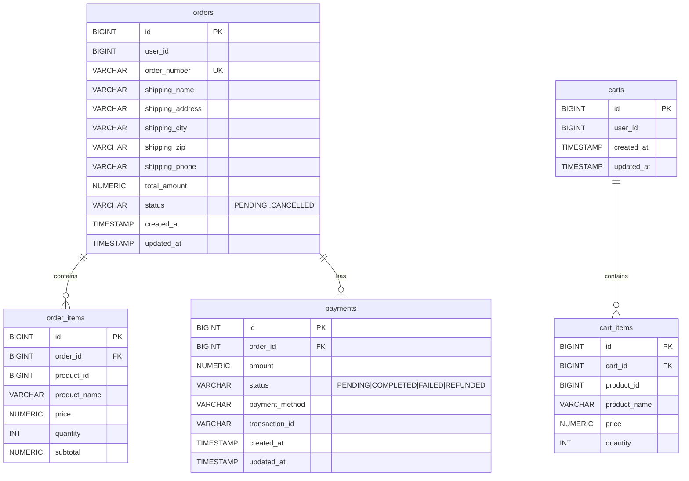
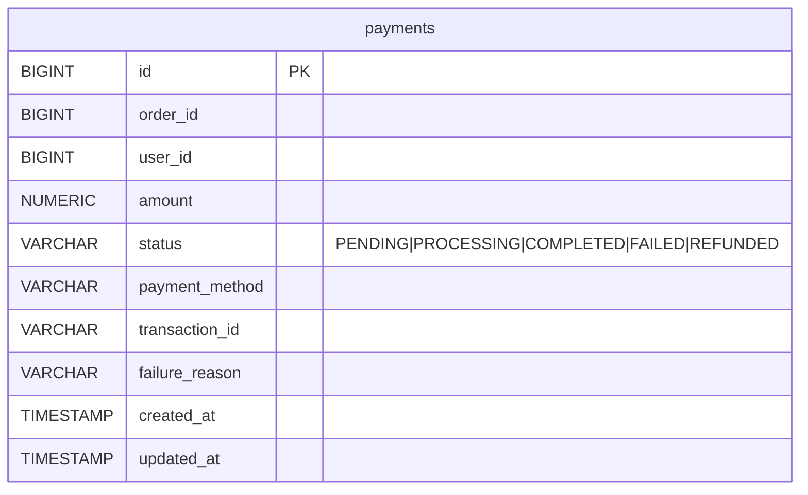
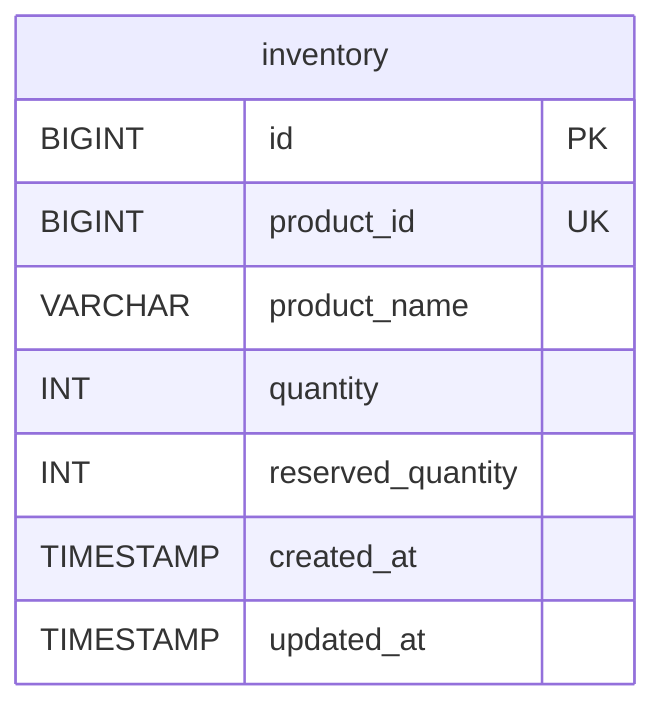
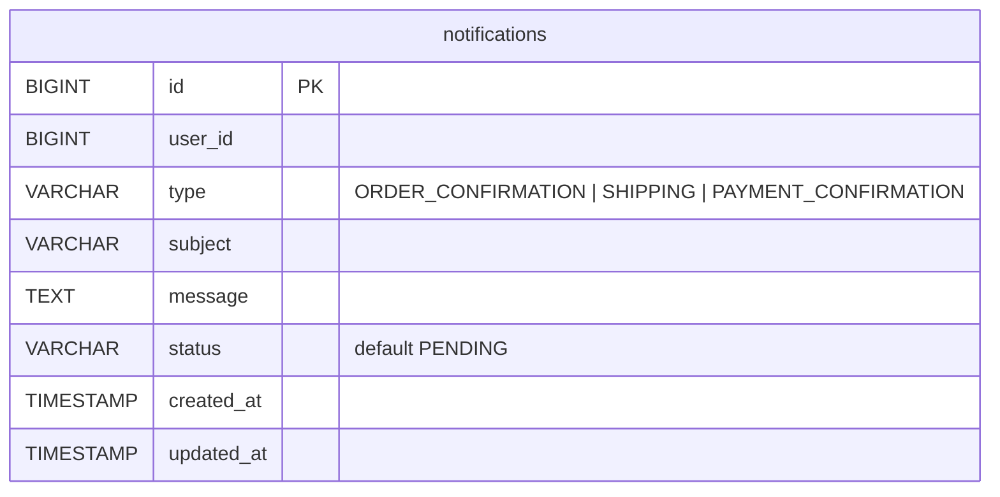
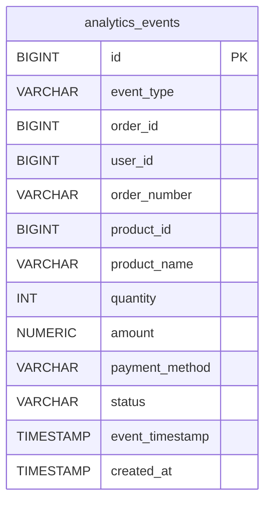
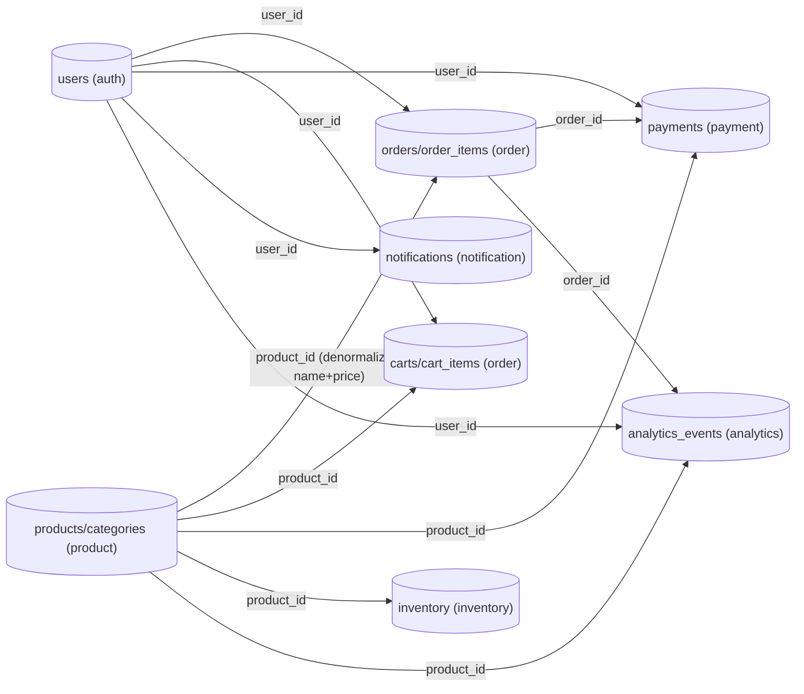

# 18.3 - Database Diagram

All services share a single PostgreSQL 16 container, but each domain has its own
dedicated database (created by `docker/postgres/init.sql`). Schemas are created
and kept up to date by Hibernate (`ddl-auto=update`).

```
PostgreSQL (postgres:16-alpine)  port 5432  user: postgres  password: demo default: admin
├── shopsphere_auth        (auth-service)
├── shopsphere_product     (product-service)
├── shopsphere_order       (order-service)
├── shopsphere_payment     (payment-service)
├── shopsphere_inventory   (inventory-service)
├── shopsphere_notification (notification-service)
└── shopsphere_analytics   (analytics-service)
```

## Database Ownership



## auth-service - `shopsphere_auth`



## product-service - `shopsphere_product`



Note: the product-service uses Redis (`db 0`) to cache product lookups.

## order-service - `shopsphere_order`



## payment-service - `shopsphere_payment`



The payment-service keeps its own copy of payment state and publishes
`payment-successful` / `payment-failed` events to Kafka.

## inventory-service - `shopsphere_inventory`



`availableQuantity` is derived: `quantity - reserved_quantity` (not persisted).

## notification-service - `shopsphere_notification`



## analytics-service - `shopsphere_analytics`



Analytics events are produced by consuming `order-created`, `payment-successful`
and `payment-failed` Kafka events.

## Cross-Domain Relationships (logical, at the application level)



There are no foreign keys referencing other databases; services join on
`id`/`user_id`/`order_id`/`product_id` at the application layer or via
denormalized columns.