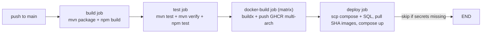

# 18.10 - Deployment Guide

This document explains how ShopSphere is deployed to a cloud ARM Virtual
Machine using Docker Compose and GitHub Actions, together with operational,
rollback and observability information.

## Deployment model

- **Pipeline**: GitHub Actions (`.github/workflows/ci.yml`), triggered on every
  push to `main`.
- **Artifacts**: multi-arch OCI images (amd64 + arm64) pushed to **GHCR**
  (GitHub Container Registry), tagged `latest` and by commit SHA.
- **Target**: an Oracle Cloud Infrastructure ARM VM (Ampere A1) running
  Linux (Ubuntu) with Docker Engine + Compose v2, plus optional PostgreSQL/Redis/Kafka.
- **Strategy**: blue-free, in-place `docker compose up -d --no-build` using the
  SHA-pinned images; per-container healthchecks gate container readiness.

## Pipeline flow



1. **build** - packages all 9 microservices (sources filters per module, tests
   skipped) and the Angular frontend.
2. **test** - `mvn test` (unit) and `mvn verify` (integration, Testcontainers)
   per service, plus `npm test` for the frontend.
3. **docker-build** - matrix over the 10 components; `docker/build-push-action`
   with `platforms: linux/amd64,linux/arm64` (QEMU), tags
   `shopsphere-commerce/<component>:latest` and `:<sha>`, pushed to GHCR after
   login with `GITHUB_TOKEN`.
4. **deploy** - if the secrets `DEPLOY_HOST`, `DEPLOY_USER`, `DEPLOY_SSH_KEY`
   exist: uploads `docker-compose.yml` and `docker/postgres/init.sql` to the
   server, stops the old stack, pulls the `<sha>` images, then
   `docker compose up -d --no-build` and verifies health.

> Only the image digest/SHA is ever deployed; the workflow pulls exactly the
> artwork produced by the same run, so the deployed code matches the tested code.

## Server requirements

- Docker Engine 24+ with Docker Compose v2.
- Ports open in the cloud security list (Oracle: Network Security List / route table):
  - `4200` - frontend (public)
  - `8080` - API gateway (public, optional)
  - `22` - SSH (administration)
  - `3000`, `9090`, `3100` - monitoring (restrict or proxy behind auth)
- ~11 GB RAM recommended for the full 14-container stack.

## Continuous deployment of this project

1. Configure GitHub secrets on the repository (`Settings > Secrets and
   variables > Actions`):

   | Secret | Value |
   |--------|-------|
   | `DEPLOY_HOST` | public IP or DNS of the VM (e.g. `51.170.143.240`) |
   | `DEPLOY_USER` | SSH user on the VM (e.g. `ubuntu`) |
   | `DEPLOY_SSH_KEY` | full private key used to log into the VM |
   | `POSTGRES_PASSWORD` (optional) | override the default postgres password |

2. Push to `main`. The `deploy` job connects via ssh, copies the compose file
   and init SQL, pulls images and restarts the stack.

3. The app is then live at `http://<DEPLOY_HOST>:4200`.

## Manual deployment (alternative)

```powershell
# upload the stack definition
scp -i C:\Users\boubk\.ssh\shopsphere.key docker-compose.yml docker/postgres/init.sql ubuntu@51.170.143.240:/tmp/

# ssh in and run
ssh -i C:\Users\boubk\.ssh\shopsphere.key ubuntu@51.170.143.240
sudo docker compose -f /tmp/docker-compose.yml up -d --pull always
```

> GHCR images are private by default; manual `docker pull` requires a
> `docker login ghcr.io` with a token that has `read:packages`. The CI deploy
> job avoids this by authenticating with `GITHUB_TOKEN`.

## Deploying the monitoring stack

On the server:

```bash
sudo docker compose -f /tmp/docker-compose.monitoring.yml up -d
```

Services: Prometheus `:9090`, Grafana `:3000` (admin/admin, auto-provisioned
datasources + `shopsphere-overview` dashboard), Loki `:3100`, Promtail (Docker
container discovery for `shopsphere*`, `kafka*`, `zookeeper*`). Point the
security list / reverse proxy at these ports with restricted access.

## Verification checklist

```bash
# all containers healthy
sudo docker compose -f /tmp/docker-compose.yml ps

# gateway health
curl -s http://localhost:8080/actuator/health | jq .status

# registry contains all services
curl -s http://localhost:8761/eureka/instances

# frontend reachable
curl -sI http://127.0.0.1:4200 | head -n 1
curl -s http://127.0.0.1:4200/api/products | head -c 200

# memory overview
free -h
```

## Rollback

Because every release is a known image SHA on GHCR:

```bash
# point the compose file at an older SHA, then
sudo docker compose -f /tmp/docker-compose.yml up -d --no-build
```

In CI, re-run the previous successful workflow run - because it deploys the
SHA it built, the exact previous release is restored.

## Common deployment issues

| Symptom | Cause / fix |
|---------|-------------|
| `deploy` job skipped | `DEPLOY_HOST`/`DEPLOY_USER`/`DEPLOY_SSH_KEY` secrets missing - add them |
| Local `docker pull ...:latest` fails with `AUTH-REQUIRED` | images are private - use a GHCR token or rely on the CI deploy job |
| Container restarts, `(unhealthy)` | dependency healthchains (registry/postgres/kafka) still starting; check `docker compose logs <service>` |
| Frontend shows stale bundle / API 404 | nginx cache - hard refresh; verify the SHA image tag matches the latest run |
| Browser `Cross-Origin Request Blocked` | gateway CORS must allow your origin (`allowedOriginPatterns("*")` in `CorsConfig`) |
| `register` works locally but not remotely | check the gateway `CORS/OPTIONS` handling and that `/api/auth` is public |
| Cross-service calls fail in Docker | replace `localhost:PORT` inside a container with the service hostname (e.g. `http://order-service:8083`) |