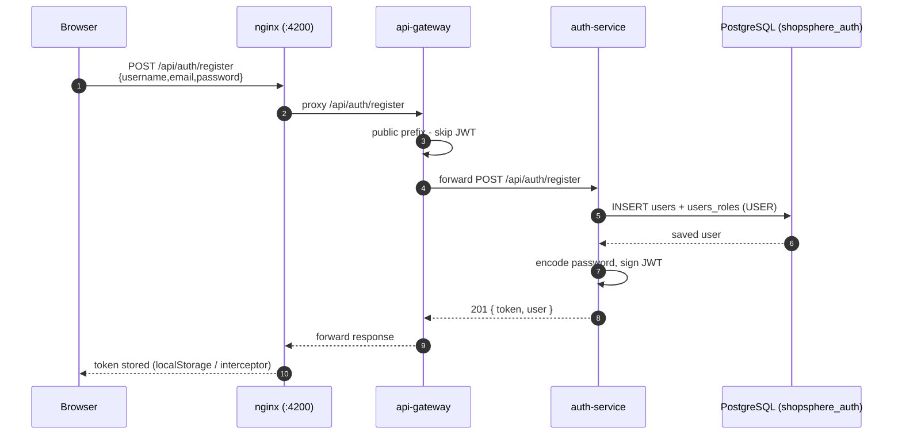
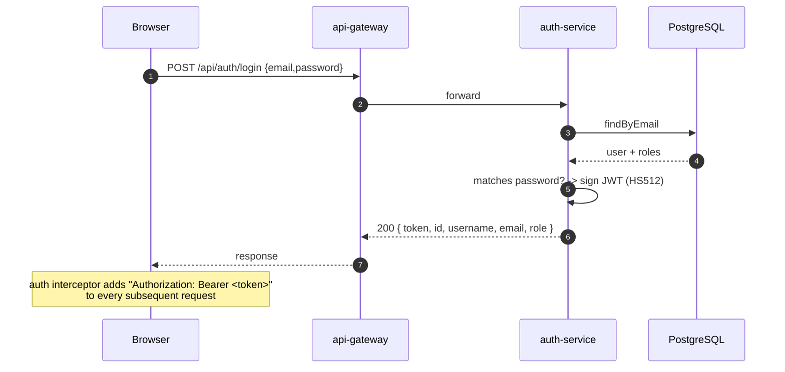
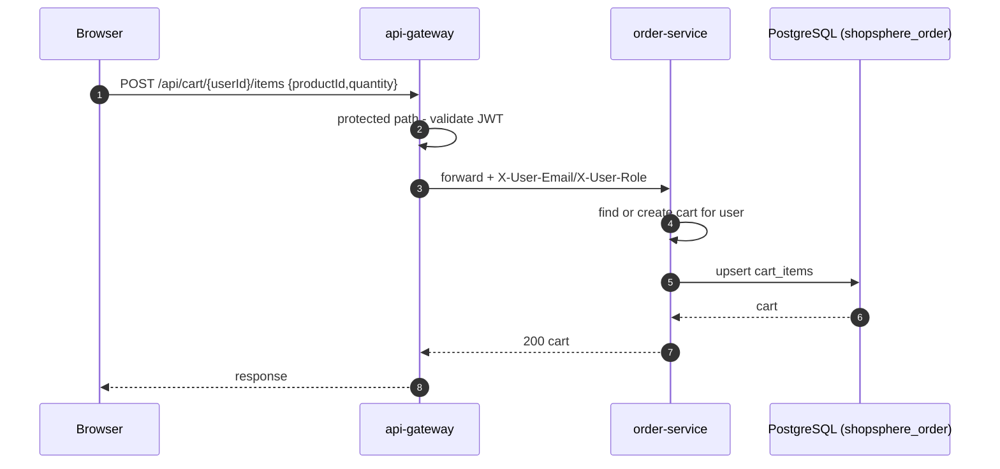
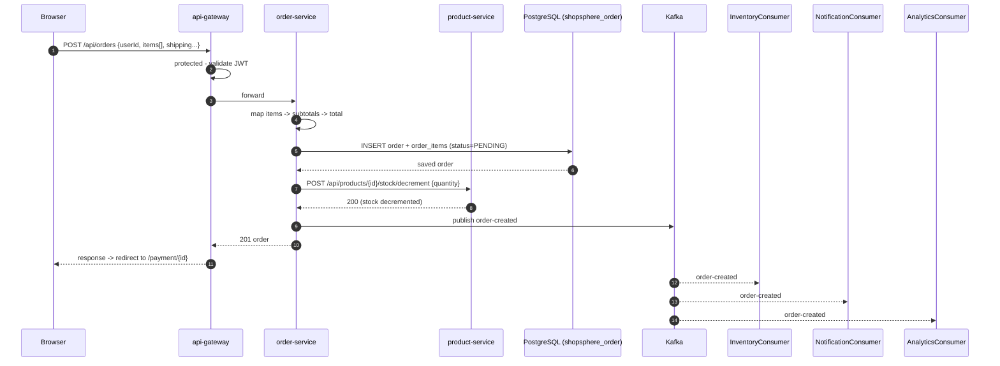
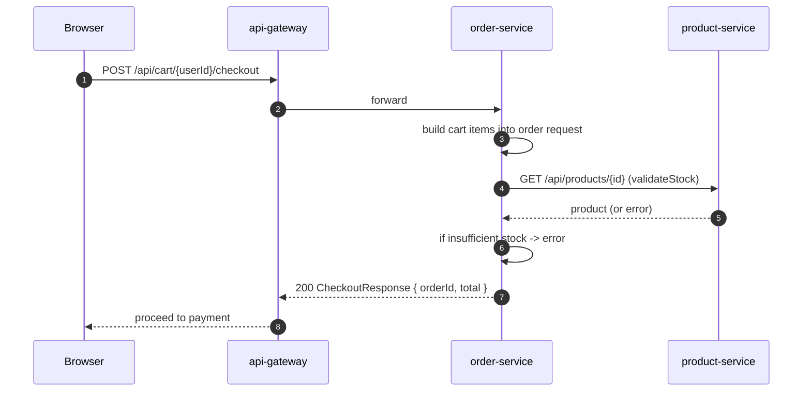
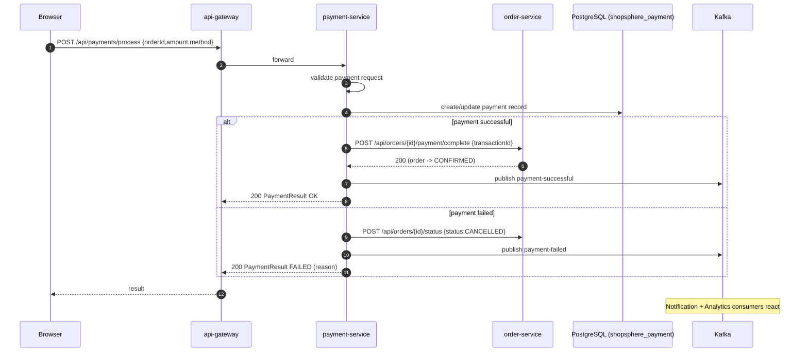
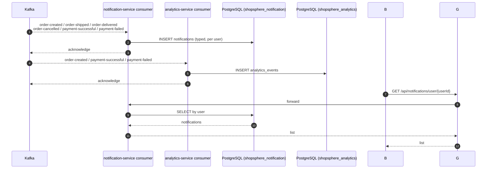
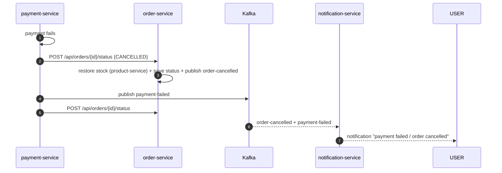

# 18.5 - Sequence Diagrams

This document contains the core end-to-end flows of the platform: registration,
login, browsing the catalog, adding to cart, placing an order, processing a
payment, and the asynchronous notification/analytics flow.

## Registration



## Login



## Browse Products (public)

```mermaid
sequenceDiagram
    autonumber
    participant B as Browser
    participant N as nginx
    participant G as api-gateway
    participant D as service-discovery
    participant PR as product-service
    participant RD as Redis

    B->>N: GET /api/products
    N->>G: proxy
    G->>D: cached instance map (refresh every 30 s)
    G->>PR: GET /api/products
    PR->>RD: cache lookup
    alt cache hit
        RD-->>PR: products
    else cache miss
        PR->>PR: PostgreSQL query
        PR->>RD: cache miss result
    end
    PR-->>G: 200 [ products ]
    G-->>N: forward
    N--->>B: JSON list
```

## Add Item to Cart



## Place an Order



## Cart Checkout



## Process a Payment



## Notifications & Analytics (async)



## Failing Payment -> Order Cancellation (compensation)

