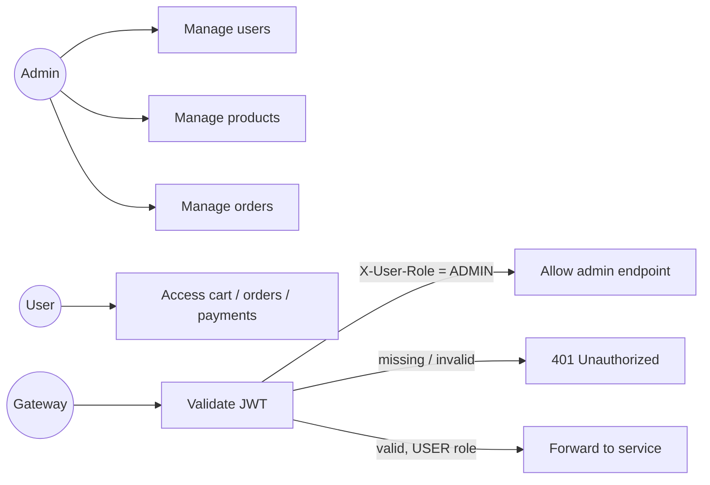

# 18.4 - Use Case Diagram

This document describes the actors and the main use cases of the ShopSphere
platform.

## Actors

| Actor | Description |
|-------|-------------|
| Guest | Unauthenticated visitor. Can browse catalog and register. |
| User | Authenticated customer with the `USER` role. |
| Admin | Authenticated administrator with the `ADMIN` role. |
| System | Automatic actors (Kafka consumers, stock service, registry). |

## Overall Use Case Diagram

```mermaid
flowchart TB
    Guest(("Guest"))
    User(("User"))
    Admin(("Admin"))

    subgraph Catalog
        UC1[Browse products]
        UC2[View categories]
        UC3[Search products]
        UC4[Filter by price]
    end

    subgraph Account
        UC5[Register]
        UC6[Login]
        UC7[View profile]
    end

    subgraph Shopping
        UC8[Add to cart]
        UC9[Manage cart quantity]
        UC10[Place order]
        UC11[Track payment]
        UC12[View code history]
        UC13[Update shipping details]
    end

    subgraph Payments
        UC14[Process payment]
        UC15[Force success / failure]
        UC16[Refund payment]
    end

    subgraph AdminFeatures
        UC17[Manage users + roles]
        UC18[Manage products]
        UC19[Manage categories]
        UC20[Manage orders / status]
        UC21[View admin dashboard]
    end

    subgraph Notifications
        UC22[Receive order-confirmation notification]
        UC23[Receive shipping notification]
        UC24[Receive payment notification]
    end

    subgraph Analytics
        UC25[View analytics dashboard]
    end

    Guest --> UC1
    Guest --> UC2
    Guest --> UC5

    User --> UC3
    User --> UC4
    User --> UC6
    User --> UC7
    User --> UC8
    User --> UC9
    User --> UC10
    User --> UC11
    User --> UC12
    User --> UC13
    User --> UC22
    User --> UC23
    User --> UC24

    Admin --> UC17
    Admin --> UC18
    Admin --> UC19
    Admin --> UC20
    Admin --> UC21
    Admin --> UC25
    Admin --> UC16
```

## Authentication & Authorization Use Cases

